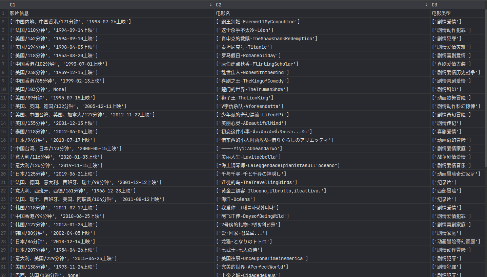
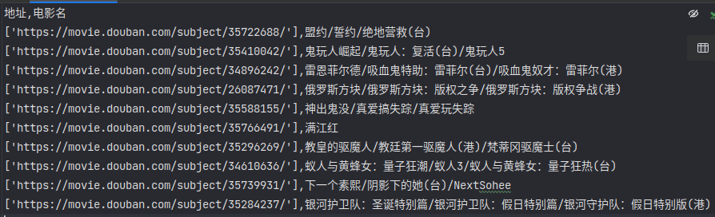
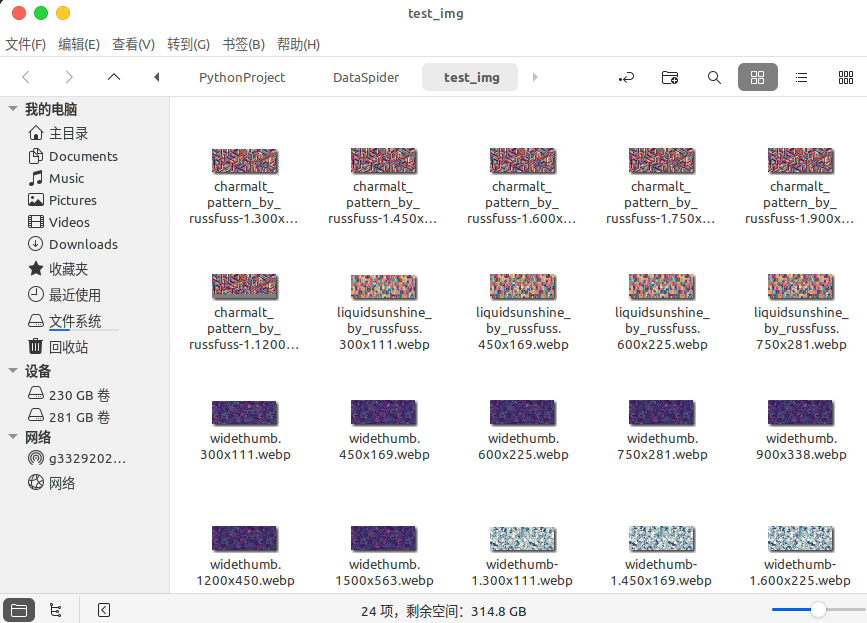
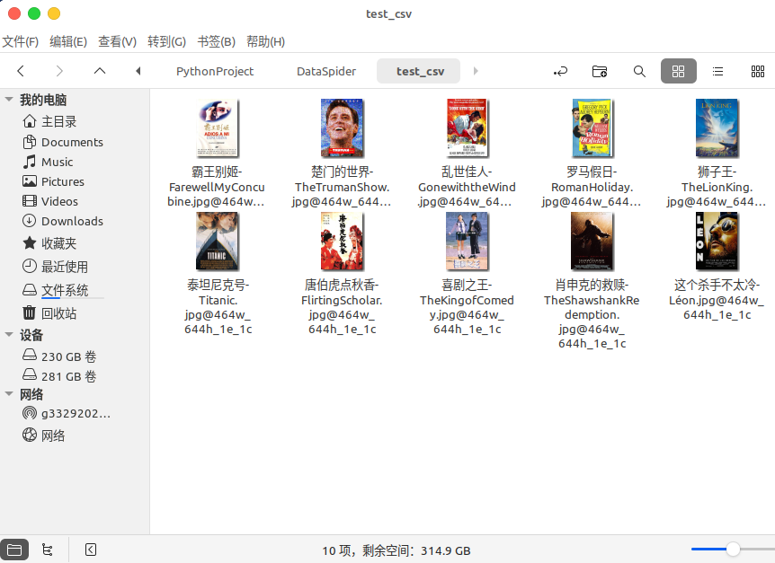

# DataSpider 使用文档

`Spider类`是DataSpider的主要组成部分，能够快速抓取网站信息。在这里我为您介绍如何使用这个类。

## 复制

由于暂时未写setup.py，所以最简单的使用方式就是将`data_spider包`以及`requirements.txt`复制到项目的根目录下，在根目录下打开终端，运行以下pip命令：

```bash
pip install -r requirements.txt -i [推荐使用国内镜像源]
```

最后删除`requirements.txt`文件，让你的项目看起来干净一点。

## 导入包中模块

```python
from data_spider import *
```

## 初始化Spider类

创建`Spider`类的实例对象时需要传入一个名字（该名字用于监控日志导入的标识）的参数。

```python
spider = Spider("spider-1")
```

## 设置参数

`Spider`类的实例对象初始化后，需要设置一些参数才能开始抓取数据。`set_params`方法用于设置这些参数。

```python
spider.set_params(
    start_urls=生成器对象或者url列表,
    rule=Rule对象,
    storage_func=StorageType或者Strorage中的方法,
    thread_num=线程数目，默认为1,
    use_dynamic=False,
    parser="html.parser"  # 解析器
)
```

### 参数说明

- `start_urls`：一个元素为字符串的可迭代对象，包含要抓取数据的网址。
- `rule`：一个Rule类，详情可见下方各项示例。
- `storage_func`：存储方法，传入Storage类实例化对象或者StorageType枚举类中的类型，详情可见下方示例，用于存储抓取到的数据。如果为`None`，则不保存数据。
- `thread_num`：一个整数，表示抓取数据使用的线程数。
- `use_dynamic`：一个布尔值，指示是否使用动态加载网页。
- `parser`：一个字符串，表示用于解析抓取数据的解析器, 默认lxml。

## 设置 User-Agent

可以使用`set_ua`方法指定 User-Agent，不设置的情况，UA管理池会随机分配。这个方法有三个参数：

```python
spider.set_ua(category="computer", browser="chrome", ua=None)
```

- `category`：一个字符串，表示要设置 User-Agent 的设备类型。
- `browser`：一个字符串，表示要使用的浏览器类型。
- `ua`：一个字符串，表示要使用的自定义 User-Agent。如果没有提供，则使用预定义的 User-Agent。

## 设置 HTTP 头

可以使用`set_headers`方法设置 HTTP 头。这个方法有两个参数：

```python
spider.set_headers(headers={"Referer": "http://www.example.com"}, is_override=False)
```

- `headers`：一个字典，包含要设置的 HTTP 头。
- `is_override`：一个布尔值，指示是否覆盖现有的 HTTP 头。

## 开始抓取

设置完参数后，可以使用`scrap`方法开始抓取数据。

```python
spider.scrap()
```

## 获取数据

抓取完成后，可以使用`get`方法获取抓取到的数据。

```python
data = spider.get()
```

这个方法有三个参数：

```python
get(*args, data=None, fuzzy: bool = True, sep: str = None)
```

- `args`：一个可变长度的参数列表，包含要获取的数据的名称。
- `data`：一个列表，包含抓取到的数据。如果为`None`，则使用`Spider`实例对象中的数据。

- `fuzzy`：一个布尔值，指示是否使用模糊匹配来获取数据。
- `sep`：一个字符串，表示多个结果之间的分隔符。如果没有提供，则使用默认的分隔符`'\n'`。

## 简单使用示例

以下是使用`Spider`类的示例（以下网址爬取仅用于技术测试，无任何非法用途）：

1. 爬取一个测试爬虫的电影信息网站中，每一个电影的名称、影片信息、影片类型

```python
from data_spider import *


def yield_urls(url: str, pages: int):
    for i in range(pages):
        yield f"{url}/{i + 1}"


if __name__ == '__main__':
    spider = Spider("spider-1")
    rule = Rule(
        "电影信息数据集",
        tag="div",
        attrs={
            "class": "el-card__body"
        },
        children=[
            # tag 标签名 class 类名 display 包含test\string\href\src等等，使用False或者True可以筛选数据甚至直接获取对应数据
            # show 表示是否需要存储对应数据，默认不存储
            Rule("电影名", tag="h2", attrs={"class": "m-b-sm"}, display={"text": False}, show=True),
            Rule("电影类型", tag="div", attrs={"class": "categories"}, display={"text": False}, show=True),
            Rule("影片信息", tag="div", attrs={"class": ["info", "m-v-sm"]}, display={"text": False}, show=True)
        ]
    )
    spider.set_params(
        start_urls=yield_urls("https://ssr1.scrape.center/page", 5),
        rule=rule,
        storage_func=Storage("./test.csv", StorageType.CSV),  # 指定使用存储路径和类型，可以直接使用StorageType.CSV，存储默认文件下
        thread_num=1
    )
    spider.scrap()

```

抓取记录：


2. 爬取豆瓣新片榜上的电影名和对应点击的地址

```python
from data_spider import *


if __name__ == '__main__':
    spider = Spider("spider-2")
    rule = Rule(
        "豆瓣新片排行数据集",
        tag="div",
        attrs={"class": "pl2"},
        children=[
            Rule("地址", tag="a", display={"href": True}, show=True),
            Rule("电影名", tag="a", display={"text": False}, show=True, sep="|")  # 如果每一项有多个元素，则以sep连接
        ]
    )
    spider.set_params(
        start_urls=["https://movie.douban.com/chart/"],
        rule=rule,
        storage_func=Storage("./test.csv", StorageType.CSV),
        thread_num=1
    )
    spider.scrap()
```

抓取记录：



3. CSDN博客文章中的各项标题

```python
from data_spider import *


if __name__ == '__main__':
    spider = Spider("spider-3")
    rule = Rule(
        "2048游戏项目设计大纲",
        tag="div",
        attrs={"class": "markdown_views"},
        children=[
            Rule("一级标题", tag="h1", display={"text": False}, show=True, sep="|"),
            Rule("二级标题", tag="h2", display={"text": False}, show=True, sep="|"),
            Rule("三级标题", tag="h3", display={"text": False}, show=True, sep="|")
        ],
        show=False
    )
    spider.set_params(
        start_urls=["https://blog.csdn.net/weixin_46231858/article/details/129977507"],
        rule=rule,
        storage_func=None,  # 不存储，默认也是不存储
        thread_num=1
    )
    spider.scrap()
    spider.join()  # 用于等待爬虫执行任务完成，其实不添加也可以，get()方法可自行等待
    print(type(spider.get()), spider.get())  # 打印爬虫获取的数据
    data = [[{'标题': '2048游戏项目计', '二级标题': '介绍|项目结构|技术栈|实现细节',
              '三级标题': 'Model类|GameView类|MessageBox类|Block类'}]]
    print(spider.get(0, 0, "一级标题", data=data, fuzzy=False))
    print(spider.get(0, 0, "标题", data=data, fuzzy=True))


```

打印如下：

```bash
<class 'list'> [[{'一级标题': '2048游戏项目设计', '二级标题': '介绍|项目结构|技术栈|实现细节', '三级标题': 'Model类|GameView类|MessageBox类|Block类'}]]
['2048游戏项目计']
[['2048游戏项目计'], ['介绍|项目结构|技术栈|实现细节'], ['Model类|GameView类|MessageBox类|Block类']]
```

4. 下载某纹理素材网上的所有图片

```python
from data_spider import *


def process_url(data: str):
    data = data.replace("\t", "").replace("\\n", "")
    data = data.split(",")
    res = []
    for d in data:
        if ".webp" in d:
            d = d.split(" ")
            res.append(f"https://www.russfuss.com{d[0]}".replace("\n", ""))
    return res


if __name__ == '__main__':
    spider = Spider("spider-4")
    rule = Rule(
        "纹理图片",
        tag="img",
        display={"srcset": True},
        show=True,
        process_method=process_url  # 中间处理方法，默认有一定的处理
    )
    spider.set_params(
        start_urls=["https://www.russfuss.com/"],
        rule=rule,
        thread_num=4
    )
    spider.scrap()
    spider.download_all("./test_img")  # 类似下方打印的，可直接调用该方法下载，下载线程和spider设值一样

    print(spider.get())
    # 打印如下： [None, None, None, [{'纹理图片': ['https://www.russfuss.com/site/assets/files/1/widethumb-1.300x111.webp',
    # 'https://www.russfuss.com/site/assets/files/1/widethumb-1.450x169.webp',
    # 'https://www.russfuss.com/site/assets/files/1/widethumb-1.600x225.webp',
    # 'https://www.russfuss.com/site/assets/files/1/widethumb-1.750x281.webp',
    # 'https://www.russfuss.com/site/assets/files/1/widethumb-1.900x338.webp',
    # 'https://www.russfuss.com/site/assets/files/1/widethumb-1.1200x450.webp',
    # 'https://www.russfuss.com/site/assets/files/1/widethumb-1.1500x563.webp']}, {'纹理图片': [
    # 'https://www.russfuss.com/site/assets/files/1/widethumb.300x111.webp',
    # 'https://www.russfuss.com/site/assets/files/1/widethumb.450x169.webp',
    # 'https://www.russfuss.com/site/assets/files/1/widethumb.600x225.webp',
    # 'https://www.russfuss.com/site/assets/files/1/widethumb.750x281.webp',
    # 'https://www.russfuss.com/site/assets/files/1/widethumb.900x338.webp',
    # 'https://www.russfuss.com/site/assets/files/1/widethumb.1200x450.webp',
    # 'https://www.russfuss.com/site/assets/files/1/widethumb.1500x563.webp']}, {'纹理图片': [
    # 'https://www.russfuss.com/site/assets/files/1/charmalt_pattern_by_russfuss-1.300x111.webp',
    # 'https://www.russfuss.com/site/assets/files/1/charmalt_pattern_by_russfuss-1.450x169.webp',
    # 'https://www.russfuss.com/site/assets/files/1/charmalt_pattern_by_russfuss-1.600x225.webp',
    # 'https://www.russfuss.com/site/assets/files/1/charmalt_pattern_by_russfuss-1.750x281.webp',
    # 'https://www.russfuss.com/site/assets/files/1/charmalt_pattern_by_russfuss-1.900x338.webp',
    # 'https://www.russfuss.com/site/assets/files/1/charmalt_pattern_by_russfuss-1.1200x450.webp',
    # 'https://www.russfuss.com/site/assets/files/1/charmalt_pattern_by_russfuss-1.1500x563.webp']}.......]]

```

打印如下：

```bash
widethumb-1.600x225.webp downloaded successfully.
widethumb-1.750x281.webp downloaded successfully.
widethumb-1.300x111.webp downloaded successfully.
widethumb-1.450x169.webp downloaded successfully.
widethumb.300x111.webp downloaded successfully.
widethumb-1.900x338.webp downloaded successfully.
widethumb.450x169.webp downloaded successfully.
widethumb.600x225.webp downloaded successfully.
widethumb-1.1200x450.webp downloaded successfully.
widethumb.900x338.webp downloaded successfully.
widethumb.750x281.webp downloaded successfully.
charmalt_pattern_by_russfuss-1.300x111.webp downloaded successfully.
charmalt_pattern_by_russfuss-1.450x169.webp downloaded successfully.
charmalt_pattern_by_russfuss-1.600x225.webp downloaded successfully.
widethumb.1200x450.webp downloaded successfully.
charmalt_pattern_by_russfuss-1.750x281.webp downloaded successfully.
./test_img/charmalt_pattern_by_russfuss-1.900x338.webp - 72.64% downloaded
.........
```

下载如下：



此外还支持指定连接下载：

```python
    spider.download_single("https://www.russfuss.com/site/assets/files/1/widethumb-1.300x111.webp", "./nice.webp")
    # 将链接对应的文件存储为当前目录下的nice.webp
```

5. 将电影信息网站第一页所有影片的关键信息获取后存储到csv中，并且下载所有封面，封面命名为电影名

```python
from data_spider import *


if __name__ == '__main__':
    spider = Spider("spider-5")
    rule = Rule(
        "电影信息数据集",
        tag="div",
        attrs={
            "class": "el-card__body"
        },
        children=[
            Rule("电影名", tag="h2", attrs={"class": "m-b-sm"}, display={"text": False}, show=True),
            Rule("电影类型", tag="div", attrs={"class": "categories"}, display={"text": False}, show=True),
            Rule("电影封面", tag="img", attrs={"class": "cover"}, display={"src": True}, show=True)
        ]
    )
    spider.set_params(
        start_urls=["https://ssr1.scrape.center/"],
        rule=rule,
        storage_func=StorageType.CSV,  # 存储到默认预设的default.csv文件
        thread_num=4
    )
    spider.scrap()
    spider.download_csv("./default.csv", "./test_csv", 2, 1)
    # 从default.csv读取数据，存储到test_csv文件夹，CSV中第2列为url列表，第1列为电影名，以电影名命名。
    # 为了下载成功，必须清空default.csv，或者保证csv中只有一个标题行（多个报错）

```

打印如下：

```bash
这个杀手不太冷-Léon.jpg@464w_644h_1e_1c downloaded successfully.
肖申克的救赎-TheShawshankRedemption.jpg@464w_644h_1e_1c downloaded successfully.
霸王别姬-FarewellMyConcubine.jpg@464w_644h_1e_1c downloaded successfully.
泰坦尼克号-Titanic.jpg@464w_644h_1e_1c downloaded successfully.
罗马假日-RomanHoliday.jpg@464w_644h_1e_1c downloaded successfully.
乱世佳人-GonewiththeWind.jpg@464w_644h_1e_1c downloaded successfully.
喜剧之王-TheKingofComedy.jpg@464w_644h_1e_1c downloaded successfully.
唐伯虎点秋香-FlirtingScholar.jpg@464w_644h_1e_1c downloaded successfully.
楚门的世界-TheTrumanShow.jpg@464w_644h_1e_1c downloaded successfully.
狮子王-TheLionKing.jpg@464w_644h_1e_1c downloaded successfully.
```

下载如下：



6. 爬取知乎文章里的目录，并且使用开启监控日志

```python
from data_spider import *


if __name__ == '__main__':
    spider = Spider("spider-6")
    rule = Rule(
        "知乎文章目录",
        tag="blockquote",
        attrs={
            "data-pid": "_WA9m1oo"
        },
        children=[
            Rule("目录", tag="br", display={"string": False}, show=True, offset=1, is_offset=True),
            # is_offset表示是否开启标签偏移，对于 <br>一、xxxx 这种内容
            # offset大于0即往后偏移，此处偏移1个单位，取出 一、xxxx
        ],
        show=False
    )
    spider.set_params(
        start_urls=["https://zhuanlan.zhihu.com/p/109342493"],
        rule=rule,
        thread_num=1
    )
    spider.scrap()
    print(spider.get())
    spider.open_monitor()  # 开启监控，将在当前路径下创建一个spider_monitor.log文件


```

打印如下：

```bash
[[{'目录': ['一、定义', '二、同角三角函数', '三、诱导公式', '四、和差角公式', '五、和差化积与积化和差公式', '六、倍角公式和半角公式', '七、万能公式', '八、辅助角公式', '九、在三角函数中的恒等式与不等式', '十、反三角函数', '十一、三角函数的导数', '<b>最后：经验分享</b>']}]]
```

监控日志如下：

```log
Name: spider-6
Begin: 2023-05-13 16:16:05.714374    End: 2023-05-13 16:16:06.168683
Urls: ['https://zhuanlan.zhihu.com/p/109342493']
Threads numbers: 1
Using Parser: lxml
Using UA: Mozilla/5.0 (Windows NT 10.0; WOW64) AppleWebKit/537.36 (KHTML, like Gecko) Chrome/46.0.2486.0 Safari/537.36 Edge/13.10586
Run time: 0.4542968273162842 ms
Scarp status: Normal operation

```

7. 定时器简单使用

```python
from data_spider import *


if __name__ == '__main__':
    spider = Spider("spider-7")
    rule = Rule(
        "知乎文章目录",
        tag="blockquote",
        attrs={
            "data-pid": "_WA9m1oo"
        },
        children=[
            Rule("目录", tag="br", display={"string": False}, show=True, offset=1, is_offset=True),
        ],
        show=False
    )
    spider.set_params(
        start_urls=["https://zhuanlan.zhihu.com/p/109342493"],
        rule=rule,
        storage_func=StorageType.JSON,
        thread_num=1
    )
    task = TimerTask()
    timer = Timer(5, False)  # 间隔5秒，False表示不是只执行1次，支持分、时、天、周、标准月（30天），使用参数time_type设定
    """
    使用参数time_type设定，默认"second"
    "second","minute", "hour","day","week","month",
    """
    timer.add_function(spider.scrap)
    timer.add_function(spider.open_monitor)
    task.add_timer(timer)
    task.start()

```

该定时任务每隔5秒执行一次抓取、存储为JSON文件以及导出监控日志

8. 使用spider的show log方法查询一些关键信息

```python
from data_spider import *


def process_url(data: str):
    data = data.replace("\t", "").replace("\\n", "")
    data = data.split(",")
    res = []
    for d in data:
        if ".webp" in d:
            d = d.split(" ")
            res.append(f"https://www.russfuss.com{d[0]}".replace("\n", ""))
    return res


if __name__ == '__main__':
    spider = Spider("spider-4")
    rule = Rule(
        "纹理图片",
        tag="img",
        display={"srcset": True},
        show=True,
        # process_method=process_url  # 中间处理方法，默认有一定的处理
    )
    spider.set_params(
        start_urls=["https://www.russfuss.com/"],
        rule=rule,
        thread_num=4
    )
    spider.scrap()
    print(spider.get())
    spider.show_log(Logs.SOURCE_RESPONSE)  # 查看HTML源码
    spider.show_log(Logs.ITEM)  # 查看父标签查询的完整标签
    spider.show_log(Logs.RULE)  # 查看使用的规则，一个字典类型的数据
    spider.show_log(Logs.ELEMENT)  # 查看处理后的元素，其中所有value值用于编写中间处理方法，比如替换、分割、遍历合并等等（参考process_url方法）
    # 此处列出3条，通过其中的值写中间处理方法、中间排除方法等来后处理你需要的数据内容：
2023-05-13 16:29:43.021509     element    <class 'dict'>   {'纹理图片': '/site/assets/files/1/future_vision_pattern.150x150.webp150w,\t\t\t\t\t\t/site/assets/files/1/future_vision_pattern.300x300.webp300w,\t\t\t\t\t\t/site/assets/files/1/future_vision_pattern.450x450.webp450w,\t\t\t\t\t\t/site/assets/files/1/future_vision_pattern.600x600.webp600w,\t\t\t\t\t\t/site/assets/files/1/future_vision_pattern.750x750.webp750w,\t\t\t\t\t\t/site/assets/files/1/future_vision_pattern.900x900.webp900w'}
2023-05-13 16:29:43.021552     element    <class 'dict'>   {'纹理图片': '/site/assets/files/1/nemesis_poster_design.150x150.webp150w,\t\t\t\t\t\t/site/assets/files/1/nemesis_poster_design.300x300.webp300w,\t\t\t\t\t\t/site/assets/files/1/nemesis_poster_design.450x450.webp450w,\t\t\t\t\t\t/site/assets/files/1/nemesis_poster_design.600x600.webp600w,\t\t\t\t\t\t/site/assets/files/1/nemesis_poster_design.750x750.webp750w,\t\t\t\t\t\t/site/assets/files/1/nemesis_poster_design.900x900.webp900w'}
2023-05-13 16:29:43.021592     element    <class 'dict'>   {'纹理图片': '/site/assets/files/1/flora_phone_case_design.150x150.webp150w,\t\t\t\t\t\t/site/assets/files/1/flora_phone_case_design.300x300.webp300w,\t\t\t\t\t\t/site/assets/files/1/flora_phone_case_design.450x450.webp450w,\t\t\t\t\t\t/site/assets/files/1/flora_phone_case_design.600x600.webp600w,\t\t\t\t\t\t/site/assets/files/1/flora_phone_case_design.750x750.webp750w,\t\t\t\t\t\t/site/assets/files/1/flora_phone_case_design.900x900.webp900w'}

    # 当然还有其他很多方法，暂时是这些主要使用的

```

